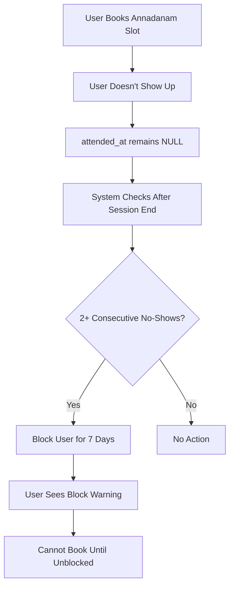

# Annadanam User Blocking System

## Overview

A comprehensive blocking system that automatically prevents users from booking Annadanam slots after missing 2 consecutive bookings. This system includes automatic detection, user notifications, and admin management tools.

## 📋 Features

### 1. **Automatic No-Show Detection**
- Tracks all bookings and their attendance status
- Automatically identifies users who miss consecutive bookings
- Blocks users for 7 days after 2 consecutive no-shows

### 2. **Enforcement Date: November 15, 2025**
- System only enforces blocks for bookings from Nov 15, 2025 onwards
- Historical data before this date is not considered for blocking

### 3. **User Experience**
- **Prominent Warning**: Blocked users see a large red alert banner at the top of the booking page
- **Booking Prevention**: Cannot proceed with bookings while blocked
- **Clear Information**: Shows reason, expiration date, and days remaining
- **Helpful Messaging**: Users are informed they can contact admin if there's an error

### 4. **Admin Management Panel**
- **View All Blocked Users**: See active and historical blocks
- **Unblock Users**: Manually remove blocks with one click
- **Auto-Block Check**: Run the blocking check manually anytime
- **Detailed Information**: See why users were blocked, when, and for how long

## 🗄️ Database Schema

### New Table: `Annadanam-Blocked-Users`

```sql
CREATE TABLE "Annadanam-Blocked-Users" (
  id uuid PRIMARY KEY,
  user_id uuid NOT NULL,
  email text NOT NULL,
  blocked_at timestamptz NOT NULL,
  blocked_until timestamptz NOT NULL,
  reason text NOT NULL,
  missed_booking_ids uuid[],
  consecutive_misses integer NOT NULL,
  status text NOT NULL, -- 'active' or 'unblocked'
  unblocked_by uuid,
  unblocked_at timestamptz,
  notes text
);
```

## 🔧 Setup Instructions

### Step 1: Run Database Migrations

Run the following SQL files in order in your Supabase SQL Editor:

1. **annadanam_user_blocking.sql** - Creates the blocking table and functions
2. **annadanam_reserve_with_blocking.sql** - Updates booking functions to check for blocks

```bash
# In Supabase Dashboard:
# 1. Go to SQL Editor
# 2. Run annadanam_user_blocking.sql
# 3. Run annadanam_reserve_with_blocking.sql
```

### Step 2: Verify Installation

After running the SQL files, verify the setup:

```sql
-- Check if table exists
SELECT * FROM "Annadanam-Blocked-Users" LIMIT 1;

-- Check if functions exist
SELECT * FROM pg_proc WHERE proname LIKE '%block%';

-- Test the blocking check (safe to run anytime)
SELECT * FROM check_and_block_no_show_users();
```

### Step 3: Access Admin Panel

1. Go to **`/admin`** (requires admin authentication)
2. Click on **"Blocked Users"** card (red border)
3. You'll see the blocked users management interface

## 📊 How It Works

### Automatic Blocking Flow



### Trigger System

The system uses a PostgreSQL trigger on the `Bookings` table:

```sql
-- Runs automatically when attended_at is updated
CREATE TRIGGER check_no_shows_trigger
  AFTER UPDATE OF attended_at ON "Bookings"
  FOR EACH ROW
  EXECUTE FUNCTION trigger_check_no_shows();
```

### Manual Check

Admins can also manually run the blocking check:

```sql
-- Returns list of newly blocked users
SELECT * FROM check_and_block_no_show_users();
```

## 🎨 User Interface

### For Users

**Block Warning Banner:**
```
⚠️ Booking Temporarily Blocked

Missed 2 consecutive bookings

Blocked until: December 1, 2025
Days remaining: 3 days

You will be able to book again after the block period expires. 
If you believe this is an error, please contact the administrator.
```

### For Admins

**Admin Panel Sections:**
1. **Currently Blocked Users** - Active blocks with unblock button
2. **Previously Unblocked Users** - Historical records
3. **Actions** - Refresh, Run Auto-Block Check
4. **Statistics** - Active blocks count, unblocked count

## 🔑 API Functions

### Check if User is Blocked

```typescript
const { data, error } = await supabase.rpc('is_user_blocked', {
  p_user_id: userId
});
// Returns: boolean
```

### Get Block Information

```typescript
const { data, error } = await supabase.rpc('get_user_block_info', {
  p_user_id: userId
});
// Returns: { is_blocked, blocked_until, reason, days_remaining }
```

### Unblock User (Admin Only)

```typescript
const { data, error } = await supabase.rpc('unblock_user', {
  p_user_id: userId,
  p_admin_user_id: adminId,
  p_notes: 'Reason for unblocking'
});
// Returns: boolean (success)
```

### List All Blocked Users (Admin Only)

```typescript
const { data, error } = await supabase.rpc('list_blocked_users');
// Returns: Array of blocked users
```

### Run Auto-Block Check (Admin Only)

```typescript
const { data, error } = await supabase.rpc('check_and_block_no_show_users');
// Returns: Array of newly blocked users
```

## 🧪 Testing

### Test Blocking Manually

1. Create 2 bookings for a test user (past dates)
2. Leave `attended_at` as NULL (don't mark attendance)
3. Run: `SELECT * FROM check_and_block_no_show_users();`
4. Verify the user appears in blocked users list

### Test Unblocking

1. Go to `/admin/annadanam/blocked`
2. Click "Unblock User" on a blocked user
3. Verify they can book again

### Test User Experience

1. While blocked, try to book a slot
2. Should see red warning banner
3. Booking button should show error message

## 📁 Files Modified/Created

### Database Files (in `/supabase/`)
- ✅ `annadanam_user_blocking.sql` - Core blocking system
- ✅ `annadanam_reserve_with_blocking.sql` - Updated reservation functions

### Frontend Files
- ✅ `src/components/annadanam/AnnadanamBooking.tsx` - Added block checking and warning UI
- ✅ `src/app/admin/annadanam/blocked/page.tsx` - New admin panel for blocked users
- ✅ `src/app/admin/page.tsx` - Added link to blocked users page

## 🔒 Security

- **Row Level Security (RLS)** enabled on blocked users table
- Users can only view their own block status
- Unblock function only callable by service role/admin
- All admin functions use SECURITY DEFINER for proper access control

## ⚙️ Configuration

### Blocking Duration
Default: 7 days. To change:

```sql
-- In annadanam_user_blocking.sql, modify:
blocked_until = now() + interval '7 days'
-- Change to desired interval: '3 days', '14 days', etc.
```

### Consecutive Misses Threshold
Default: 2 consecutive misses. To change:

```sql
-- In check_and_block_no_show_users(), modify:
IF consecutive_misses >= 2 THEN
-- Change to desired threshold
```

### Enforcement Start Date
Default: November 15, 2025. To change:

```sql
-- In multiple functions, modify:
enforcement_start_date date := '2025-11-15';
```

## 🐛 Troubleshooting

### User Says They're Blocked But Shouldn't Be

1. Check in admin panel: `/admin/annadanam/blocked`
2. View their booking history
3. Verify if they actually missed 2 consecutive bookings
4. If error, use "Unblock User" button

### Auto-Block Not Working

1. Verify trigger exists: `\d "Bookings"` in psql
2. Check function exists: `SELECT * FROM pg_proc WHERE proname = 'check_and_block_no_show_users';`
3. Manually run: `SELECT * FROM check_and_block_no_show_users();`
4. Check dates are >= Nov 15, 2025

### User Can Still Book While Blocked

1. Verify block is active: `SELECT * FROM "Annadanam-Blocked-Users" WHERE user_id = '...' AND status = 'active';`
2. Check `blocked_until` is in the future
3. Verify frontend is calling `checkBlockStatus()`
4. Check browser console for errors

## 📈 Monitoring

### Check Block Statistics

```sql
-- Active blocks
SELECT COUNT(*) FROM "Annadanam-Blocked-Users" 
WHERE status = 'active' AND blocked_until > now();

-- Total blocks ever
SELECT COUNT(*) FROM "Annadanam-Blocked-Users";

-- Blocks by reason
SELECT reason, COUNT(*) 
FROM "Annadanam-Blocked-Users" 
GROUP BY reason;
```

### Find Users About to Be Unblocked

```sql
SELECT email, blocked_until, 
  EXTRACT(HOUR FROM (blocked_until - now())) AS hours_remaining
FROM "Annadanam-Blocked-Users"
WHERE status = 'active' 
  AND blocked_until > now()
  AND blocked_until < now() + interval '24 hours'
ORDER BY blocked_until;
```

## 🎯 Best Practices

1. **Run Auto-Block Check Daily**: Either manually or via scheduled job
2. **Review Blocks Weekly**: Check admin panel for any issues
3. **Communicate Policy**: Inform users about the 2-strike rule
4. **Be Responsive**: Quickly unblock users who report errors
5. **Keep Notes**: When unblocking, add notes explaining why

## 🔄 Automated Scheduling (Optional)

To run the auto-block check automatically:

### Option 1: Supabase Edge Function (Recommended)

Create an edge function that runs daily:

```typescript
// supabase/functions/check-no-shows/index.ts
import { createClient } from '@supabase/supabase-js'

Deno.serve(async (req) => {
  const supabase = createClient(
    Deno.env.get('SUPABASE_URL') ?? '',
    Deno.env.get('SUPABASE_SERVICE_ROLE_KEY') ?? ''
  )
  
  const { data, error } = await supabase
    .rpc('check_and_block_no_show_users')
  
  return new Response(JSON.stringify({ data, error }))
})
```

Then schedule with GitHub Actions or cron-job.org to call it daily.

### Option 2: PostgreSQL pg_cron Extension

```sql
-- Requires pg_cron extension
CREATE EXTENSION IF NOT EXISTS pg_cron;

-- Run at 2 AM daily
SELECT cron.schedule(
  'check-annadanam-no-shows',
  '0 2 * * *',
  $$SELECT * FROM check_and_block_no_show_users()$$
);
```

## 📞 Support

For issues or questions about the blocking system:

1. Check this documentation first
2. Review admin panel for user-specific issues
3. Check Supabase logs for database errors
4. Review browser console for frontend errors

## ✅ Summary

The Annadanam blocking system provides:

- ✅ Automatic detection of consecutive no-shows
- ✅ 7-day blocking period for repeat offenders
- ✅ Clear user communication with warning banners
- ✅ Powerful admin tools for management
- ✅ Full audit trail of blocks and unblocks
- ✅ Secure, scalable database implementation
- ✅ Enforced from November 15, 2025 onwards

Users are encouraged to attend their booked slots, and the system ensures fairness while giving admins full control when needed.

